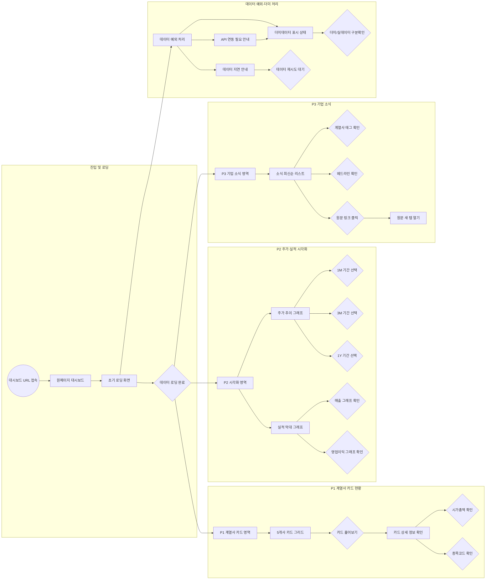

```mermaid
flowchart LR

  subgraph s1 ["진입 및 로딩"]
    n1(("대시보드 URL 접속"))
    n2["원페이지 대시보드"]
    n3["초기 로딩 화면"]
    n4{"데이터 로딩 완료"}
  end

  subgraph s2 ["P1 계열사 카드 현황"]
    n5["P1 계열사 카드 영역"]
    n6["5개사 카드 그리드"]
    n7{"카드 훑어보기"}
    n8["카드 상세 정보 확인"]
    n9{"시가총액 확인"}
    n10{"종목코드 확인"}
  end

  subgraph s3 ["P2 주가·실적 시각화"]
    n11["P2 시각화 영역"]
    n12["주가 추이 그래프"]
    n13{"1M 기간 선택"}
    n14{"3M 기간 선택"}
    n15{"1Y 기간 선택"}
    n16["실적 막대 그래프"]
    n17{"매출 그래프 확인"}
    n18{"영업이익 그래프 확인"}
  end

  subgraph s4 ["P3 기업 소식"]
    n19["P3 기업 소식 영역"]
    n20["소식 최신순 리스트"]
    n21{"계열사 태그 확인"}
    n22{"헤드라인 확인"}
    n23{"원문 링크 클릭"}
    n24["원문 새 탭 열기"]
  end

  subgraph s5 ["데이터 예외·더미 처리"]
    n25["데이터 예외 처리"]
    n26["API 연동 필요 안내"]
    n27["더미데이터 표시 상태"]
    n28{"더미/실데이터 구분확인"}
    n29["데이터 지연 안내"]
    n30{"데이터 재시도 대기"}
  end

  n1 --> n2
  n2 --> n3
  n3 --> n4
  n4 --> n5
  n4 --> n11
  n4 --> n19
  n3 --> n25
  n5 --> n6
  n6 --> n7
  n7 --> n8
  n8 --> n9
  n8 --> n10
  n11 --> n12
  n12 --> n13
  n12 --> n14
  n12 --> n15
  n11 --> n16
  n16 --> n17
  n16 --> n18
  n19 --> n20
  n20 --> n21
  n20 --> n22
  n20 --> n23
  n23 --> n24
  n25 --> n26
  n25 --> n27
  n27 --> n28
  n25 --> n29
  n29 --> n30
  n26 --> n27
```
